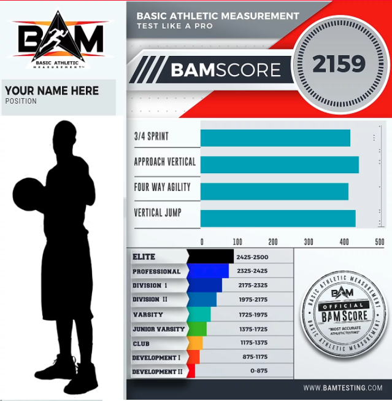
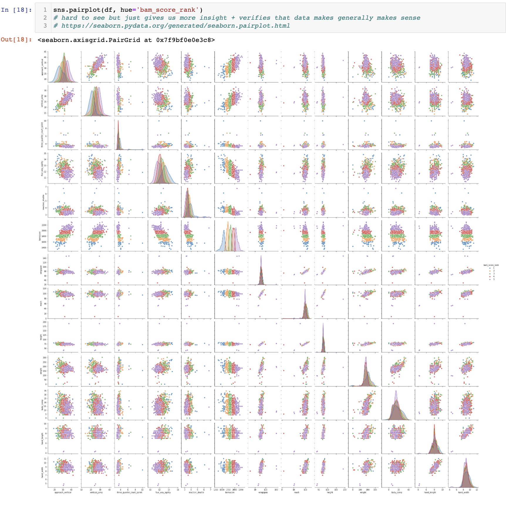
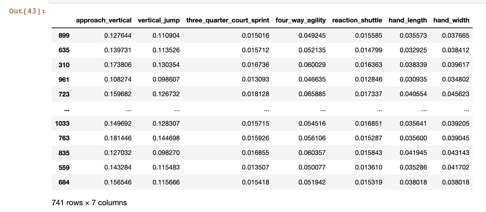
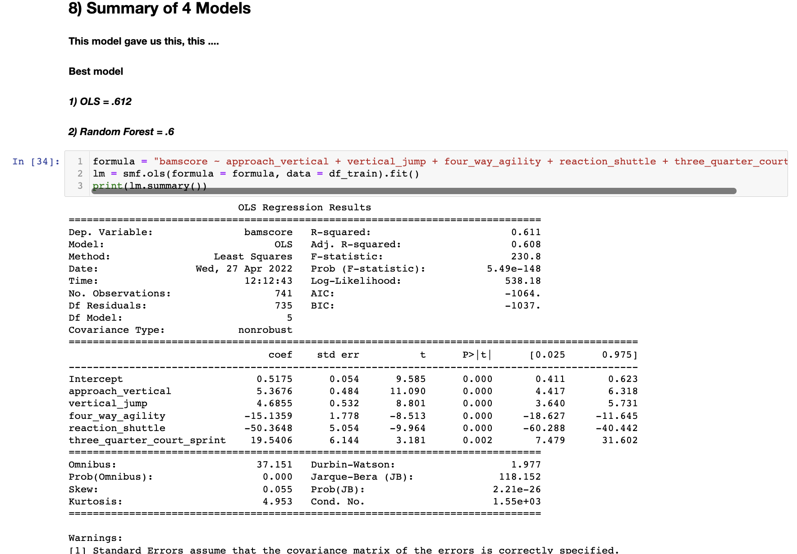

# From Plan A to The NBA

## Description

This project is an exploritory data analysis using NBA Combine assessment data from High School & Division 1 athletes who are trying to get to the next level. The purpose of this project is to identify:

1) Which NBA Combine assessment is the biggest delineator for athletes that make it to the next level?
2) How do athletes identify their strengths and weaknesses + how do they improve upon them?

Today, the probability of competing in athletics beyond high school is extremely slim. In fact, only 3.5% of high school basketball athletes end up competing at the college level. With such a slim chance of high school athletes making it to the next level, student athletes are beginning to plan, prepare and train younger and younger.

With this in mind, student athletes need to begin understanding how they compare to the competition. In order to get to that next level, student athletes need to be elite/above the rest and players/coaches need insight into their areas of improvement to help athletes reach the next level.

So how are players/coaches going to figure out areas of improvement, track progress, and understand their athletic strengths and weaknesses? Well I have the answer for you! 

Let me introduce you to BAM TESTING!

BAM Testing created a standardized athletic performance assessment to provide quantitative evidence to quantitatively measure how athletes compare to the rest of the competition. With this quantitative data, BAM draws insight into athletes strengths and weaknesses through the BAM Score - A standardized assessment for critical insight into athletic strengths and weaknesses.

What makes a good BAMScore?

Example of BAMScore

## Definition of NBA Combine Protocols and Anthros

bamid
- Number randomly assigned to each athlete without knowing full name

bamscore
- Single Numerical Value that measures and benchmarks athletic performence
- "Athletic SAT Score"
- Standardized athletic assessment that gives coaches insight into where players need improvement

## Protocols (Athletic Tests)
approach_vertical
- running start, jump as high as you can

vertical_jump
- stationary start, jump as high as you can

three_quarter_court_sprint
- 75 ft straight sprint

four_way_agility
- run arouund 4 points in box, run back through

reaction_shuttle
- agility test - start in middle of box, run left, right, run back and finish through left line          

## Anthros (Body Measurements)
wingspan
- horizontal distance from arms extended side to side

reach
- standing vertical reach

height
- how tall you are in inches

weight
- how much you weigh in pounds

body_comp
- body fat (varies in measurement methods)

hand_length
- vertical length of hand

hand_width
- horizontal length of hand

### # 1 Import Libraries
- Pandas, NumPy, Matplotlib, SciPy, Seaborn, Plotly, Scikit-learn

### # 2 Import & Clean Data
- Dropped Hand Length and blank columns messing up data
- Identified NAN's and blank columns then filled and replaced with means

### # 3 Visualize - Pairplot
- Plotted all protocols and anthros to see distribution
- Pairplot shows us trends and validates our summary at the end
- Plotted to find more outliers/data that did not make sense
- Created 2 similar violin plots for each parameter with respect to BAMScore

### # 4 Normalizing Data
- Normalize training data and scale it between [0,1]

### # 5 Feature Importance Analysis
- Height and agility tests are the most important features
- We found a list of 7 features that are the most important
- 3/4 court sprint, reaction shuttle, 4 way agility, vertical jump, approach vertical, hand width and hand length

### # 6 Modeling
- Build Baseline model
- Goal: figure out most important features in model that can predict bamscore
- I want to know which factors to work on in order to improve bamscore so I can tell the coaches what to help the athletes improve

### #7 Iterated Model and added random forrest model
- Iterated model and tried different model types to mainly increase r2 and coeff

### # 8 Conclusion and Insight
- Reaction shuttle, 3/4 court sprint, and 4-Way agility are the most important protocols that delineate BAMScores
- Overall On average, shorter athletes have better scores (except vertical jump and approach vertical)
- Shorter athletes are much better at agility/fast twitch based protocols
- Some multicollinearity with using both jump test data but they are both very important and part of top 5

## Future Work
- add more iterations to models to increase r2 closer to .8
- Calculate actual numerical value that would increase bam score rather than just knowing which factors will increase bamscore the most
- Create email system to spit out summary and send to coaches and players
- Spend time with just protocols
- Test model via classifier instead using rank method from first project build